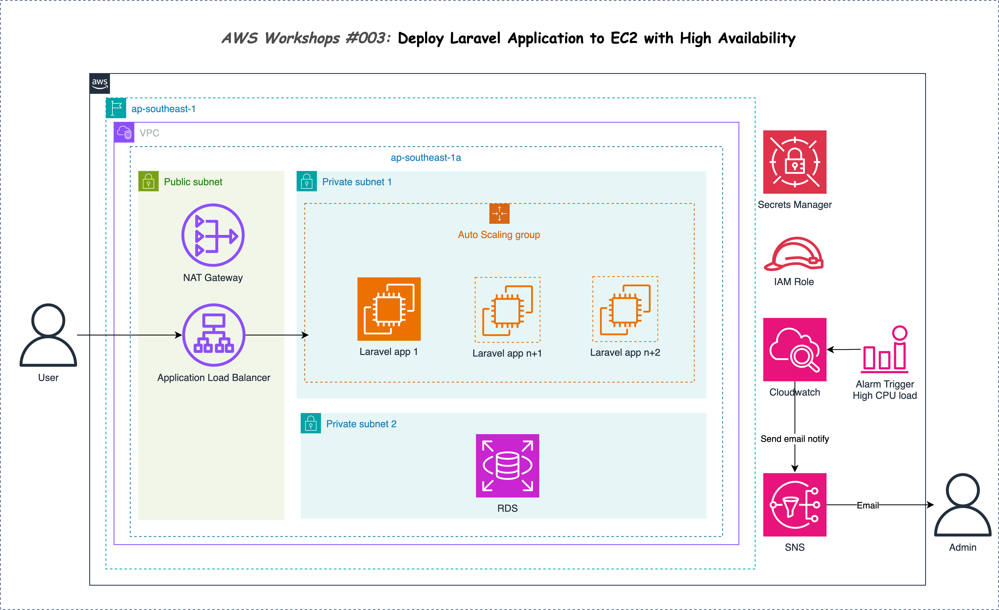

# AWS Workshop #003 Deploy Laravel Application to EC2 with High Availability

- Visit my workshop at this [link](https://003.tsukpa.blog)

You only need care about 2 folder inside **resource** folder:

- Folder `terraform` is the IAC code for this workshop --> Go to my [workshop link](https://003.tsukpa/blog) for documents, after that, you can create/destroy the infrastructure (Its will run automatically).
- Folder `src` is for the Laravel app will be testing

If you like this workshop, give me a star ⭐ . Thank you 🙆‍♂️🙆‍♂️🙆‍♂️🙆‍♂️🙆‍♂️🙆‍♂️

View all of my workshop at: [https://tsukpa.blog/aws-workshops](https://tsukpa.blog/aws-workshops)

